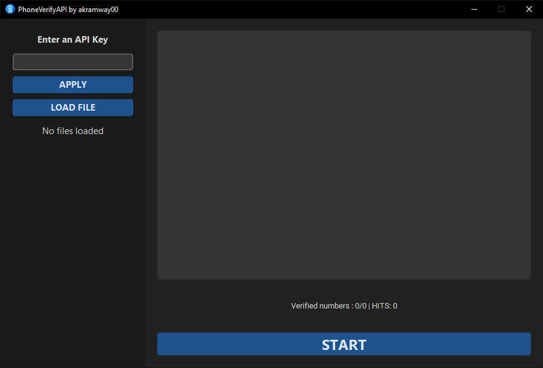
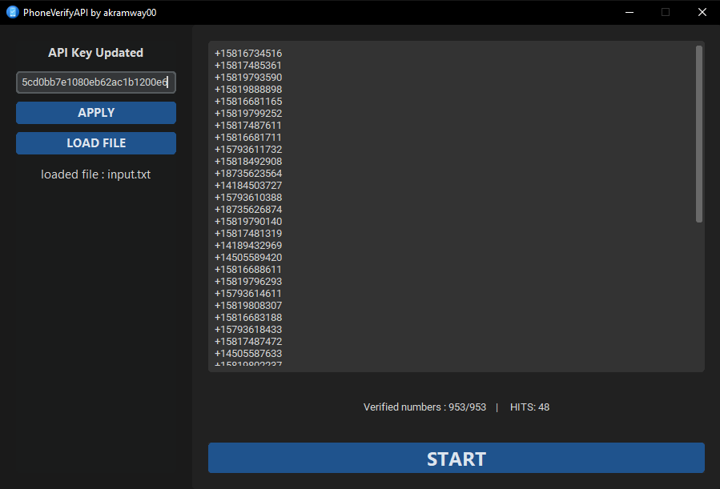

# PhoneVerifyAPI

**PhoneVerifyAPI** is a modern and efficient tool designed to validate phone numbers in bulk using the NumVerify.com API. This software is ideal for scenarios where ensuring the authenticity of phone numbers is critical, such as in fraud prevention, enhancing security, or maintaining accurate databases. By quickly verifying large lists of numbers, you can save time and ensure reliability.

## Features

- **Bulk Validation:** Verify large quantities of phone numbers simultaneously.
- **NumVerify API Integration:** Utilizes the NumVerify.com API for accurate phone number validation.
- **User-Friendly Interface:** Built with a sleek and intuitive design using customtkinter.
- **File Support:** Load phone numbers from text files for seamless processing.
- **Real-Time Updates:** View verification progress and results in real-time.
- **Export Valid Numbers:** Save verified numbers to a text file for future use.

## Screenshots

**1. Default State on Launch:**



**2. After Processing a File:**



## Installation

### Using the Pre-Compiled `.exe` File

1. Locate the `main.exe` file in the project directory.
2. Run the `.exe` file to start the application immediately without installing Python or any dependencies.

### Using Python

1. Clone this repository:
   ```bash
   git clone https://github.com/your-username/PhoneVerifyAPI.git
   cd PhoneVerifyAPI
   ```

2. Install the required Python package:
   ```bash
   pip install customtkinter requests
   ```

3. Ensure Python 3.7 or higher is installed on your system.

4. Run the application:
   ```bash
   python main.py
   ```

## Usage

1. **Launch the Application:** Start the program using either the `.exe` file or the `main.py` script.

2. **Enter API Key:** Obtain an API key from [NumVerify.com](https://numverify.com) and input it into the application.

3. **Load a File:** Use the **Load File** button to select a text file containing phone numbers (one number per line).

4. **Start Verification:** Click the **Start** button to begin validating the numbers. The results will be displayed in real-time.

5. **Export Results:** Valid phone numbers will be automatically saved to `output.txt` in the application directory.

## Phone Number Format

Phone numbers should be provided in international format for accurate validation. For example:
```
+14155552671
+919876543210
+442071838750
+15146783499
```

## How It Works

1. **API Request:** Each phone number is validated by sending a request to the NumVerify API.
2. **Response Handling:** The application processes the API's response to determine validity.
3. **Real-Time Feedback:** The GUI updates in real-time with the progress and results.

## Notes

- Ensure your NumVerify API key is active and has sufficient credits for the number of requests you plan to make.
- The application requires an active internet connection for API communication.
- Invalid or improperly formatted numbers will be ignored.

## Future Improvements

- Add support for additional phone number validation APIs.
- Include more detailed error messages for failed verifications.
- Optimize multithreading for even faster processing.

## License

This project is licensed under the MIT License. See the LICENSE file for more information.

## Author

Developed by akramway00.
